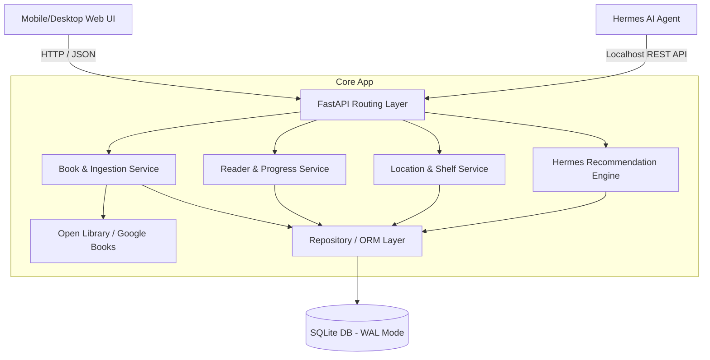
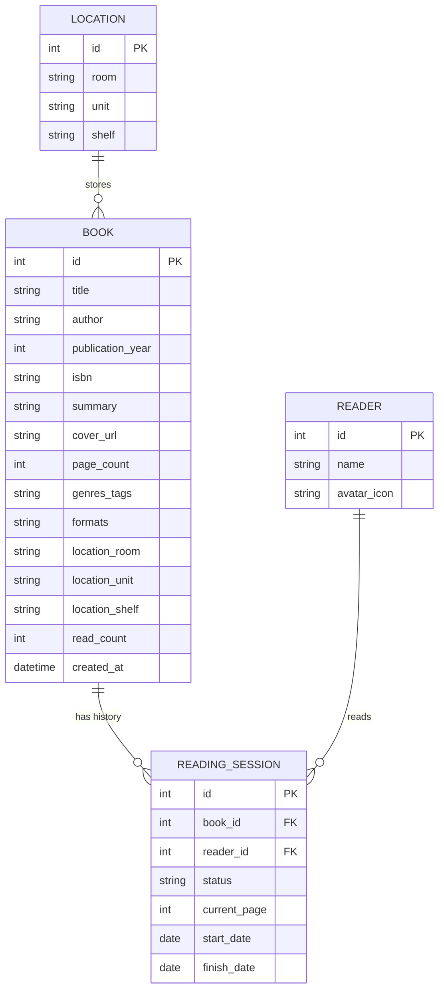
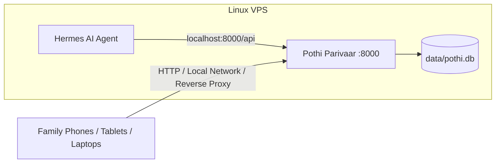

# Architecture Spine — Pothi Parivaar

## Design Paradigm: Layered Modular Monolith

Pothi Parivaar is architected as a lightweight **Layered Modular Monolith** packaged as a self-contained service designed for zero-friction deployment on a Linux VPS alongside the Hermes AI agent.



### Layer Boundaries
1. **Presentation Layer (`frontend/`)**: **Vue.js 3 + Vuetify 3** SPA bundled with Vite. Uses pure out-of-the-box Material Design components (`v-app`, `v-card`, `v-chip`, `v-dialog`, `v-text-field`, `v-progress-linear`, `v-autocomplete`, `v-navigation-drawer`) with zero custom themes or custom CSS overrides.
2. **API & Interface Layer (`app/api/`)**: FastAPI routers validating requests with Pydantic schemas, exposing endpoints for web clients and Hermes agent.
3. **Domain Service Layer (`app/services/`)**: Business logic for manual/ISBN book ingestion, reading lifecycle transitions, and recommendation heuristics.
4. **Data Access Layer (`app/db/` & `app/models/`)**: SQLModel / SQLAlchemy repository managing SQLite schema migrations and queries.

---

## Invariants & Rules

### AD-1 — Backend Framework & OpenAPI Definition [ADOPTED]
* **Binds**: `FR-12`, `FR-13`, `FR-14`, `NFR-3`
* **Prevents**: Inconsistent API contracts between the Web UI and the Hermes Agent skill.
* **Rule**: The backend must use **FastAPI (Python 3.11+)** with Pydantic v2 schemas. Every endpoint must have explicit response models and docstrings so `/openapi.json` accurately acts as the live tool definition for Hermes.

### AD-2 — SQLite Datastore with WAL Mode [ADOPTED]
* **Binds**: `FR-1`, `FR-9`, `FR-11`, `NFR-1`, `NFR-4`
* **Prevents**: Over-engineered database infrastructure (e.g. running external Dockerized database clusters) for a 1,000-book family library.
* **Rule**: Data persistence must use **SQLite** with Write-Ahead Logging (`PRAGMA journal_mode=WAL;`). The database file resides in a dedicated volume (`data/pothi.db`) allowing instant point-in-time file backups.

### AD-3 — Out-of-the-Box Vue 3 + Vuetify 3 Frontend [ADOPTED]
* **Binds**: `FR-1`, `FR-2`, `FR-3`, `FR-5`, `FR-6`, `FR-9`, `FR-10`, `NFR-2`
* **Prevents**: Fragile custom UI stylesheets or maintenance overhead for kid-friendly UI components.
* **Rule**: The frontend must use **Vue 3 + Vuetify 3** out-of-the-box with standard Material Design components and native responsive grid layout (`v-container`, `v-row`, `v-col`). No bespoke design systems or custom CSS stylesheets.

### AD-4 — Dual Ingestion Pipeline Isolation [ADOPTED]
* **Binds**: `FR-5`, `FR-6`
* **Prevents**: Network dependency blocking children from entering books manually if external ISBN APIs are slow or down.
* **Rule**: Manual book creation (`POST /api/books`) must be entirely independent of the ISBN lookup service (`GET /api/isbn/{isbn}`). ISBN lookup acts strictly as an advisory pre-fill service; the user can create, edit, and save books without internet connectivity.

### AD-5 — Hierarchical Physical Location Schema [ADOPTED]
* **Binds**: `FR-3`, `FR-7`
* **Prevents**: Inconsistent shelf naming preventing children from locating physical books.
* **Rule**: Physical locations are stored as a 3-tier structured tuple: `room` (e.g. "Office"), `unit` (e.g. "Main Shelf"), and `shelf` (e.g. "Shelf 2"), with an auto-generated computed display string `room / unit / shelf`.

### AD-6 — Hermes Agent Localhost REST Integration [ADOPTED]
* **Binds**: `FR-12`, `FR-13`, `FR-14`
* **Prevents**: Complex authentication protocols or webhook setups breaking local agent execution.
* **Rule**: Hermes interacts over standard HTTP GET/POST calls to `http://localhost:8000/api/*`. Endpoints return concise, token-efficient JSON summaries formatted specifically for LLM tool consumption.

---

## Consistency Conventions

| Concern | Convention |
| :--- | :--- |
| **API Pathing** | `/api/v1/{resource}` (e.g., `/api/v1/books`, `/api/v1/readers`, `/api/v1/isbn/{code}`) |
| **Identifiers** | Auto-incrementing Integer IDs (`id: 1, 2, ...`) for simplicity and child-friendly references |
| **Dates & Timestamps** | ISO 8601 strings (`YYYY-MM-DD` for publication/reading dates; `YYYY-MM-DDTHH:MM:SSZ` for timestamps) |
| **Error Handling** | Standard RFC 7807 problem details JSON: `{ "detail": "Human-readable message", "code": "ERROR_CODE" }` |
| **Book Status State Machine** | `available` ↔ `reading` ➔ `finished` (increments `read_count` on reaching `finished`) |

---

## Stack (Seed)

| Component | Technology | Version | Purpose |
| :--- | :--- | :--- | :--- |
| **Runtime** | Python | `3.11+` | Core backend runtime |
| **Web Framework** | FastAPI | `^0.115` | Async REST API & OpenAPI schema generator |
| **ORM / Data Models** | SQLModel / SQLAlchemy | `^0.0.22` | Type-safe SQLite database interactions |
| **Server** | Uvicorn | `^0.32` | ASGI server |
| **HTTP Client** | HTTPX | `^0.27` | Async external ISBN fetching (Open Library) |
| **Frontend Framework** | Vue.js | `^3.4` | Reactive component framework |
| **UI Component System**| Vuetify | `^3.6` | Material Design components out-of-the-box |
| **Build Tool / Bundler**| Vite | `^5.4` | Fast frontend dev and production bundling |
| **Datastore** | SQLite | `3.40+` | Local file-based transactional database |

---

## Structural Seed

```text
pothi-parivaar/
├── app/
│   ├── main.py              # FastAPI app initialization, CORS, static file serving
│   ├── config.py            # App settings (database path, port)
│   ├── models.py            # SQLModel schemas (Book, Reader, ReadingSession, Location)
│   ├── database.py          # SQLite connection and session management
│   ├── api/
│   │   ├── books.py         # Book CRUD, search, filter endpoints
│   │   ├── readers.py       # Reader profiles and active session tracking
│   │   ├── locations.py     # Shelf and location helper endpoints
│   │   ├── isbn.py          # Open Library / Google Books metadata resolver
│   │   └── hermes.py        # Dedicated Hermes AI recommendation & status endpoints
│   └── services/
│       ├── book_service.py  # Book catalog domain logic
│       ├── isbn_service.py  # External ISBN lookup and cover image fallback
│       └── recommend.py     # Rule-based / keyword recommendation ranker for Hermes
├── frontend/                # Vue 3 + Vuetify 3 Application
│   ├── package.json
│   ├── vite.config.js
│   ├── index.html
│   └── src/
│       ├── main.js          # Vue app init + Vuetify plugin setup
│       ├── plugins/
│       │   └── vuetify.js   # Standard Vuetify setup (MDI icons, light/dark theme)
│       ├── App.vue          # Main layout (v-app, v-app-bar, v-navigation-drawer)
│       ├── components/
│       │   ├── BookCard.vue        # Cover card with shelf badge and reader status
│       │   ├── BookDetailDialog.vue # Full book info & reader assignment modal
│       │   ├── AddBookDialog.vue   # Manual entry + ISBN lookup tabs
│       │   ├── ReaderTracker.vue   # Currently reading drawer & page updater
│       │   └── ShelfManager.vue    # Physical location browse & filter
│       └── services/
│           └── api.js       # Axios/fetch client communicating with FastAPI
├── hermes_skill/            # Hermes Agent Integration
│   └── pothi_skill.py       # Standalone Hermes tool/skill definition for VPS
├── data/
│   └── pothi.db             # Local SQLite database (gitignored)
├── requirements.txt         # Python dependencies
└── run.py                   # Development & production server entry point
```

---

## Entity Relationship Overview



---

## Deployment & VPS Envelope



---

## Capability → Architecture Map

| Capability / Requirement | Component | Governed By |
| :--- | :--- | :--- |
| **FR-1, FR-2, FR-3, FR-4** (Catalog CRUD & Search) | `app/api/books.py`, `app/services/book_service.py` | `AD-1`, `AD-2` |
| **FR-5, FR-6** (Dual Ingestion & ISBN) | `app/api/isbn.py`, `app/services/isbn_service.py` | `AD-3` |
| **FR-7, FR-8** (Locations & Formats) | `app/api/locations.py`, `app/models.py` | `AD-4` |
| **FR-9, FR-10, FR-11** (Reader Tracking) | `app/api/readers.py`, `app/models.py` | `AD-2` |
| **FR-12, FR-13, FR-14** (Hermes Integration) | `app/api/hermes.py`, `hermes_skill/pothi_skill.py` | `AD-1`, `AD-5` |
| **NFR-1, NFR-2, NFR-3** (Speed, Mobile, VPS) | `static/`, `app/main.py`, `data/pothi.db` | `AD-1`, `AD-2` |

---

## Deferred Decisions

* **Authentication & Authorization**: Deferred to V2 if multi-family or public internet access is needed.
* **Vector Semantic Search**: Deferred; text keyword and tag filtering in SQLite is more than fast enough for 1,000–5,000 books without requiring vector database dependencies.
* **In-App PDF/EPUB Streaming**: Deferred; file path / format indicators are tracked in V1.
